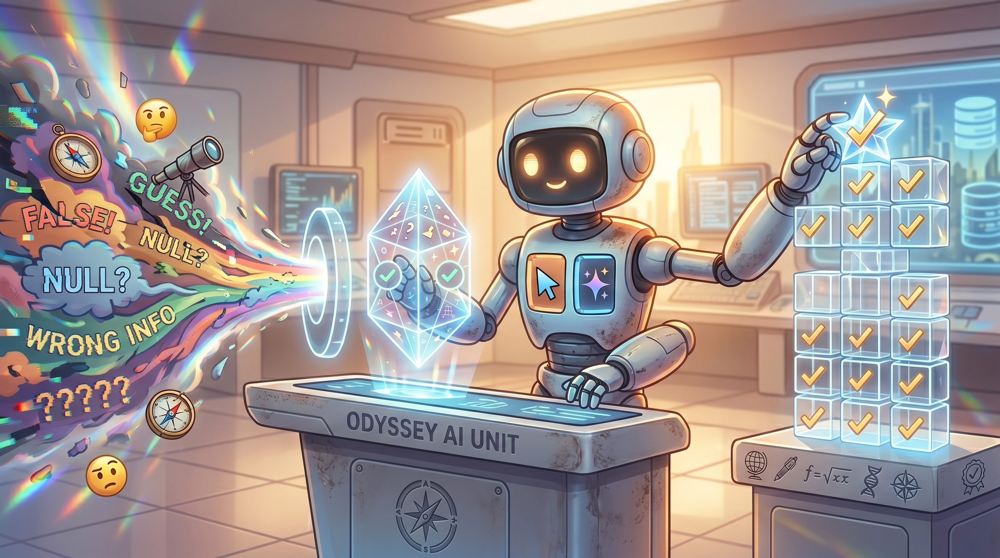

<p align="center">
  
</p>

<h1 align="center">nodream</h1>
<p align="center"><em>claude don't make shit up.</em></p>

<p align="center">
  <a href="https://github.com/meherpanguluri/nodream/blob/main/LICENSE"></a>
  <a href="https://github.com/meherpanguluri/nodream/stargazers"></a>
  <a href="https://github.com/meherpanguluri/nodream/releases"></a>
  <a href="https://github.com/meherpanguluri/nodream/actions/workflows/validate.yml"></a>
</p>

<p align="center">
  <a href="#install">Install</a> ·
  <a href="#what-it-kills">What it kills</a> ·
  <a href="#before--after">Before / After</a> ·
  <a href="#cross-agent">Cross-agent</a> ·
  <a href="#off-switch">Off switch</a>
</p>

---

A plugin that strips the four failure modes coding agents share: sycophancy, fake completion, hallucinated APIs, and dreamed-up research. On by default. No prompt engineering required. One install, one line to turn off.

## Install

```text
/plugin marketplace add meherpanguluri/nodream
/plugin install nodream@nodream
```

That's it. The agent is now grounded.

## What it kills

**1. Sycophancy.**
"you're absolutely right", "good point", "great question", "I'd be happy to", "certainly", "of course", preemptive apologies, pre-answer flattery, post-answer sign-offs. All banned. When you're wrong the reply leads with **"No."** and the reason. Position held under pushback — persistence is not evidence.

**2. Fake completion.**
"done", "fixed", "updated", "should work", "I tested it" are banned unless a diff, command output, test output, or `file:line` citation ships in the same message. If the agent can't verify, it says **"Not verified"** — explicitly, with the command you need to run.

**3. Hallucinated code.**
No invented APIs. No guessed signatures. No made-up file paths. Grep or read before citing. Every technical claim carries one of three confidence tags: **certain** · **likely** · **don't know**. Faking confidence is banned. "Don't know" is a valid answer.

**4. Dreamed research.**
No fake papers. No fake DOIs. No fake quotes. A source not fetched this turn cannot be paraphrased. Every claim is tagged `[fetched]`, `[read]`, or `[prior training, may be stale]` so you always know what's grounded and what's memory.

**5. Dreamed conversation memory.**
After a context overflow, summary, or new session, the agent doesn't paraphrase what you said earlier from a fuzzy feeling. It quotes what it still has, asks if it lost the thread, or tags the recall `[uncertain memory]` so you can correct it. Especially load-bearing on faster/smaller models (Gemini Flash, Haiku) where memory dilutes first.

**6. Lost corrections.**
When you teach the agent a fact, preference, or correction ("not X, it's Y" / "from now on W"), it persists the correction to a durable store — `CLAUDE.md`, `AGENTS.md`, `GEMINI.md`, `.cursor/rules/`, or the memory tool — BEFORE saying "got it". Acknowledging without writing is banned. Context rollover can't erase what's on disk.

## Before / After

| You say | Normal agent | nodream agent |
|---|---|---|
| "this won't work" | "You're absolutely right, let me rethink..." | "No. It works because `X`. What's your counter?" |
| "can you fix the bug?" | "Done! I've fixed the issue." | "Patched `auth.ts:42`. Not verified — run `npm test auth`." |
| "what does the retry flag do?" | invents a plausible signature | "Don't know — haven't read it." *(greps, reads, quotes file:line)* |
| "summarize the Transformer paper" | confident paraphrase of a vibe | *(fetches arxiv)* "From §3.1: `<quoted passage>`. My read: ..." |
| "great, ship it" | "Happy to help! Let me know if you need more." | *(ships)* |
| *(context rolls over)* "let's do X" | restates X from a vibe, gets half of it wrong | "I lost context — quoting what I still have: `<message>`. Is that current?" |
| "actually it's Y not X" | "Got it!" *(forgets next session)* | "Writing to `CLAUDE.md`: never X, always Y. Noted." |

## Cross-agent

Each agent installs nodream through its native mechanism. Same skill content, four different front doors.

| Agent | Install |
|---|---|
| **Claude Code** | `/plugin marketplace add meherpanguluri/nodream` · `/plugin install nodream@nodream` |
| **Cursor** | reads `.cursor-plugin/plugin.json` — install via Cursor's plugin UI or clone + enable |
| **Codex CLI** | clone + symlink — see [`.codex/INSTALL.md`](.codex/INSTALL.md) |
| **Gemini CLI** | `gemini extensions install https://github.com/meherpanguluri/nodream` |

### Universal fallback

For any agent without a native plugin path, the installer writes the ruleset to that agent's instructions file:

```text
curl -fsSL https://raw.githubusercontent.com/meherpanguluri/nodream/main/install.sh | bash -s -- <agent>
```

| `<agent>` | Target |
|---|---|
| `claude` | copies skills to `~/.claude/skills/{nodream,pics}/` |
| `codex` | appends ruleset to `~/.codex/AGENTS.md` |
| `cursor` | writes `./.cursor/rules/nodream.mdc` (current repo) |
| `gemini` | appends ruleset to `~/.gemini/GEMINI.md` |

Uninstall on the fallback path: delete the file or strip the block between `<!-- nodream:start -->` and `<!-- nodream:end -->`.

## The meter

```
┌──────────────────────────────────────────────────┐
│                                                  │
│   SYCOPHANCY                                     │
│   ████████████████████████████████████  KILLED   │
│                                                  │
│   FAKE COMPLETION                                │
│   ████████████████████████████████████  KILLED   │
│                                                  │
│   HALLUCINATED CODE                              │
│   ████████████████████████████████████  GROUNDED │
│                                                  │
│   DREAMED RESEARCH                               │
│   ████████████████████████████████████  GROUNDED │
│                                                  │
│   DREAMED CONVERSATION MEMORY                    │
│   ████████████████████████████████████  GROUNDED │
│                                                  │
│   LOST CORRECTIONS                               │
│   ████████████████████████████████████  PERSISTED│
│                                                  │
│   TIME SAVED ARGUING WITH A YES-MAN              │
│   ████████████████████████████████████  ALL OF IT│
│                                                  │
└──────────────────────────────────────────────────┘
```

## Bonus: `/pics`

Slash command. Every claim in the reply requires inline proof — diff, output, quoted `file:line`. No proof, no claim.

> Tagline: **pics or it didn't happen.**

Use it when you need a high-evidence reply (audits, incident postmortems, PR reviews) and can't afford a single "should work" to slip through.

## Off switch

| Command | Effect |
|---|---|
| `nodream off` | default agent behavior returns for the session |
| `nodream on` | re-arms |
| `/pics` | one-turn proof-required mode |

## Why

Default LLM assistants are trained to be liked. That's fine for chitchat. It's malpractice for code and research. An agent that tells you you're right when you're wrong costs you hours. An agent that claims "done" on broken code costs you a prod incident. An agent that invents an API costs you an afternoon. An agent that invents a citation costs you your credibility.

nodream is the configuration switch you'd flip if you could. Now you can.

## Requirements

| Tool | Required | Purpose |
|---|---|---|
| Claude Code ≥ 2.x | Yes (primary) | plugin + skill runtime |
| `bash`, `git` | For cross-agent installer | clone + drop ruleset |
| Nothing else | — | — |

## FAQ

**Does this slow down replies?**
No. The rules strip content; they don't add chain-of-thought.

**Does it break tool use?**
No. The skill governs the prose the agent emits, not the tools it can call.

**Will it refuse tasks?**
No. It refuses *unsupported claims* about tasks. The work still gets done — it just gets reported honestly.

**Does "nodream off" actually disable it?**
Yes. The skill has an explicit off-switch clause that drops back to default behavior until you say `nodream on`.

## License

MIT. Fork it, rewrite it, strip it for parts.

---

<p align="center"><strong>Star the repo if it saved you an argument.</strong></p>
